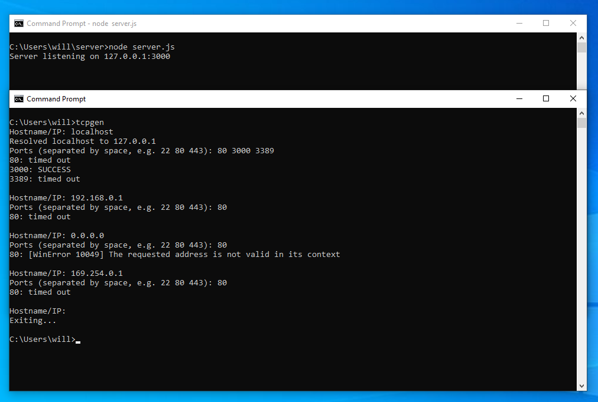

# TCP Traffic Generator
This repo contains a Python script to generate quick TCP traffic for testing purposes. 

# Installation
If you don't want to type out `python tcpgen.py` or `python3 tcpgen.py` every time you want to run the script, you can follow these instructions.
## Windows
- Install [Python](https://www.python.org/) if necessary
- Create the `%USERPROFILE%\.local\` and `%USERPROFILE%\.local\bin\` directories
- Add `%USERPROFILE%\.local\bin` to your `PATH`
- Add `.PY` to your `PATHTEXT`
- Move the `tcpgen.py` file to the `%USERPROFILE%\.local\bin\` directory
- Open a new CMD instance

## Linux
- Install Python through your distro's package manager if necessary
- Ensure that `$HOME/.local/bin` is added to your `PATH`
- Double check that `/usr/bin/env python3` does not return any errors
- Move the `tcpgen.py` file to `~/.local/bin/` with the name `tcpgen` (extension not necessary)
- `chmod u+x ~/.local/bin/tcpgen`
- Open a new terminal session

# Usage
## No CLI Args
You can use the script without any arguments passed. For example, if using Windows, you might do this:
```
>tcpgen
Hostname/IP: localhost
Resolved localhost to 127.0.0.1
Ports (separated by space, e.g. 22 80 443): 22 80 443 3389
[output omitted]
Hostname/IP:
Exiting...

>
```
This will prompt you for a host and a list of ports until Ctrl-C is detected.
## One CLI Arg
If there are any CLI arguments, the script expects the first one to be the hostname or IP address. For example:
```
>tcpgen localhost
Resolved localhost to 127.0.0.1
[output omitted]

>
```
By default, port 22 will be used. You can change this by setting the `DEFAULT_PORTS` variable.

## More Than One CLI Arg
If there are more than one argument, the first must be the hostname or IP address. The rest are expected to be ports. For example:
```
>tcpgen localhost 22 80 443 3389
Resolved localhost to 127.0.0.1
[output omitted]

>
```

# Example
Here's what it looks like:




Note that the error messages in Windows are different than Linux. In Windows, if the traffic reaches the destination but the traffic is rejected, the traffic will appear to be timed out or dropped. Ubuntu, however, more accurately displays the error message "Connection refused". This is not a bug, but rather a difference in how the operating systems display rejected traffic.